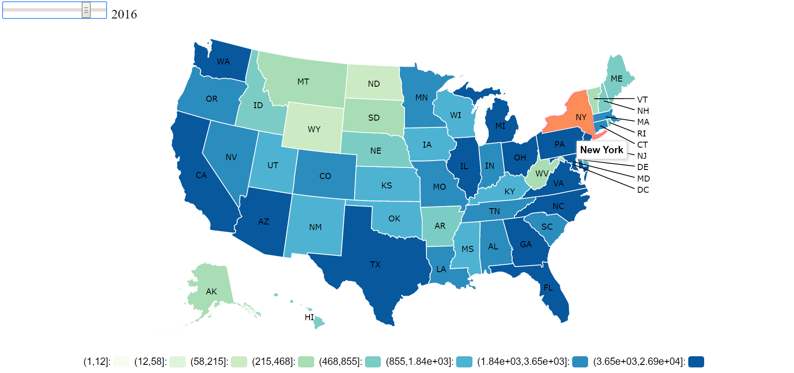

# Spring 2017
# Project for myself: Which are the states that have the most financial complaints each year?

### [Project Description](doc/)
+ Project title: Which are the states that have the most financial complaints each year?
+ This project is conducted by *Ruxue Peng, Columbia UNI: rp2815*

+ Project summary:  
  I approach the question by visualizing the dataset provided by data.gov, the Consumer Complaint Database. I cleaned the data, format the data and feed it to a new package I've found, called "rMaps". I used it to create a interactive choropleth map that allows user to look at the state by state count of financial complaints of each year(from 2011 to 2017).
  

To reproduce the result:
Main result can be reproduced from the rmaps.Rmd file in the lib forder.  
*Before you start, please clone/download this entire project folder and set R/Rstudio working directory at the Data folder of this project*

Further Learning Materials:  
[rmaps](http://rmaps.github.io/)
[Choropleth map](https://en.wikipedia.org/wiki/Choropleth_map)
